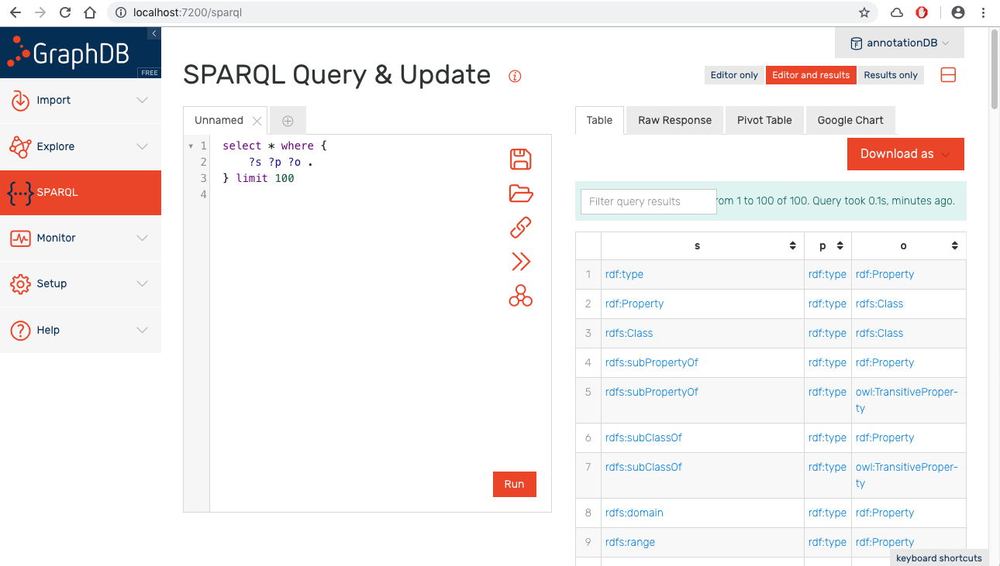
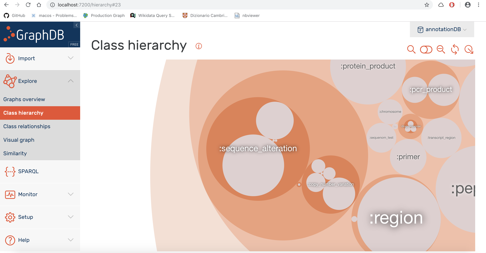
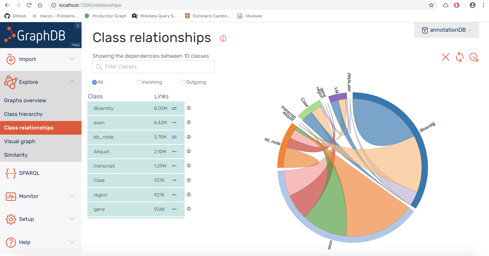
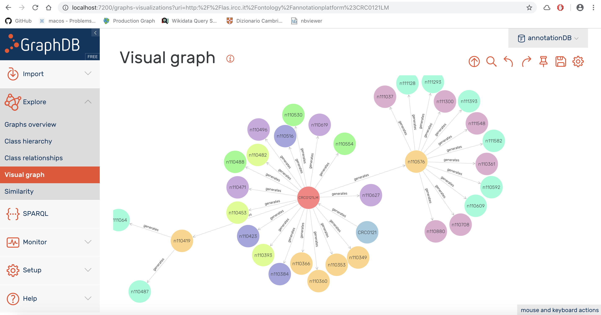
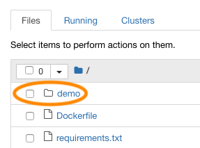
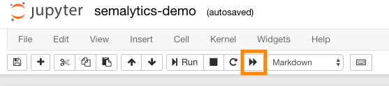

# Semalytics core demo

Welcome to the demo of the data framework of Semalytics, a semantic-based tool for analyzing hierarchical data in translational cancer research, which exploits [Wikidata](https://www.wikidata.org) as extended knowledge base for data annotation. This demo is bundled with the paper:

>_Semalytics: a semantic analytics platform for the exploration of distributed and heterogenous cancer data (in translational research) (currently under review)_


## Quick overview

If you are just interested in glancing at static examples of `SPARQL` queries and check out how we got paper results, you might want to take a look at [this computational narrative](http://nbviewer.jupyter.org/github/lasircc/semalytics-demo/blob/master/notebook/demo/semalytics-demo.ipynb).

Otherwise, if you want to take a deep dive into the platform, check out following sections to run it on your system.

## Running Semalytics

We provide a Docker-based installation to run the Semalytics data core locally.

### Requirements

Before you start, you need to install:

* [`docker`](https://docs.docker.com/install/) (tested: v.18.09.0-ce or newer)
* [`docker-compose`](https://docs.docker.com/compose/install/) (tested: v.1.23.2 or newer)

Note #1: if you run this demo on macOS, we recommend to set at least to _4.0 GiB_ the memory limit of the Docker engine. See [this how-to](https://stackoverflow.com/a/44533437/4820341).

Note #2: this demo is powered by [Ontotext GraphDB™](https://www.ontotext.com/products/graphdb/) (Free version): a semantic graph database (RDF triplestore) and by [Jupyter Notebook](http://jupyter.org/).

### Getting a copy of this repository and testing data

A copy of this repo is necessary to run Semalytics. Move to your home directory (or to a folder where your user can read-write with no permissions problem) and `clone` the repo into the sub-folder `semalytics-demo`:

```bash
$ git clone https://github.com/lasircc/semalytics-demo.git semalytics-demo
```

Now it's time to get data and put them in the right place. Download the data file `annotationDB_paper.tar.gz` from this [URL](https://drive.google.com/drive/folders/1k_Vhn_JIPhXKBoXMAFK9xwJVr6x5g8Gw?usp=sharing), uncompress it into the folder `<path-to-the-repo>/semalytics-demo/graphdb/graphdb-home/data/repositories/`

```bash
$ tar zxvf annotationDB_paper.tar.gz -C <path-to-the-repo>/semalytics-demo/graphdb/graphdb-home/data/repositories/
```

It creates this directory tree:
```
semalytics-demo/
|
 - graphdb/
    |
    - graphdb-home/
        |
        - data/
            |
            - repositories/
                |
                - annotationDB/
```

>**Legal note**: we allow anyone to use this data for demonstration purpose only. We do not allow any different usage. For further information, please contact paper authors.

>**Data disclaimer**: this is a prototype of a research platform. These data should not be used for emergencies or medical or professional advice or any clinical decision making.

Now, you just need to run the app 🚀

### Running Semalytics

Now move to the folder `<path-to-the-repo>/semalytics-demo/`. To start the containers (i.e., `notebook`and `graphDB`), run:

`$ docker-compose up`

Such a process may take several minutes... Anyone up for a cup of coffee? ☕

Once ended, you will see the aggregated output of each container. It must resemble the following one:


```
notebook    | [I 13:43:49.757 NotebookApp] Writing notebook server cookie secret to /root/.local/share/jupyter/runtime/notebook_cookie_secret
notebook    | [I 13:43:50.031 NotebookApp] Serving notebooks from local directory: /app
notebook    | [I 13:43:50.031 NotebookApp] The Jupyter Notebook is running at:
notebook    | [I 13:43:50.031 NotebookApp] http://(fb55e2e36794 or 127.0.0.1):8888/?token=7cf64f7836e030722d0254a1e828909a47378e67ab3069f4
notebook    | [I 13:43:50.031 NotebookApp] Use Control-C to stop this server and shut down all kernels (twice to skip confirmation).
notebook    | [C 13:43:50.031 NotebookApp]
notebook    |
notebook    |     Copy/paste this URL into your browser when you connect for the first time,
notebook    |     to login with a token:
notebook    |         http://(fb55e2e36794 or 127.0.0.1):8888/?token=7cf64f7836e030722d0254a1e828909a47378e67ab3069f4
graphdb     | [INFO ] 2018-12-04 13:43:53,866 [main | c.o.g.Config] GraphDB Home directory: /opt/graphdb/home
graphdb     | [INFO ] 2018-12-04 13:43:53,867 [main | c.o.g.Config] GraphDB Config directory: /opt/graphdb/home/conf
graphdb     | [INFO ] 2018-12-04 13:43:53,869 [main | c.o.g.Config] GraphDB Data directory: /opt/graphdb/home/data
graphdb     | [INFO ] 2018-12-04 13:43:53,870 [main | c.o.g.Config] GraphDB Work directory: /opt/graphdb/home/work
graphdb     | [INFO ] 2018-12-04 13:43:53,871 [main | c.o.g.Config] GraphDB Logs directory: /opt/graphdb/home/logs
graphdb     | [INFO ] 2018-12-04 13:43:58,454 [main | c.o.g.s.GraphDB] Started GraphDB in workbench mode at port 7200.
```

Please, grab and copy the login token from the log at the end of the `docker-compose` process. It is shown at the end of the URL as the param `token`. In the example above, it is:

```
7cf64f7836e030722d0254a1e828909a47378e67ab3069f4
```

You will use that for accessing Jupyter Notebook.

Great job, you are all set!

(Press **Ctrl+C** to stop containers)


### Using GraphDB to explore data

You can access GraphDB workbench at [`http://localhost:7200/`](http://localhost:7200/)

Select "**annotationDB**" from the dropdown menu at the top right corner of the Web interface. Now you can use GraphDB to explore translational data.



#### Visualizing [class hierarchy](http://graphdb.ontotext.com/documentation/free/quick-start-guide.html#class-hierarchy)

You can visualize the hierarchy of classes in Semalytics ontology. Go to _Explore -> Class hierarchy_ to get a bubble diagram and to interact with it.



#### Visualizing [class relationships](http://graphdb.ontotext.com/documentation/free/quick-start-guide.html#class-relationships)

In the section _Explore -> Class relationships_ you can visualize links between the individual instances of Semalytics classes.




#### Visualizing [graph](http://graphdb.ontotext.com/documentation/free/quick-start-guide.html#explore-your-data-and-class-relationships)

For showing a graphical representation of triples, move to _Explore -> Visual graph_ and insert a URI in the Easy graph search box (e.g., `http://las.ircc.it/ontology/annotationplatform#CRC0121LM`). An interactive graph centered on that URI will be opened.




#### Querying and other info

A collection of queries is available in [the notebook](http://nbviewer.jupyter.org/github/lasircc/semalytics-demo/blob/master/notebook/demo/semalytics-demo.ipynb). You can copy and paste them directly in the [SPARQL tab](http://graphdb.ontotext.com/documentation/standard/quick-start-guide.html#query-your-data) of GraphDB to run them.

Further information about the usage of GraphDB can be found in the [official documentation](http://graphdb.ontotext.com/documentation/free/).


### Semalytics walkthrough with Jupyter Notebook + Python

You can explore, run, and modify a Python-based Jupyter Notebook. It explores Semalitycs data with several queries and additional explanations. To use it, open up the Jupyter interface passing your token through the following URL:

```
http://localhost:8888/?token=<your-token-here>
```

Open the folder `demo` and click on `semalytics-demo.ipynb` to start the notebook.



Now, you can explore, edit and run the walkthrough. To run all the cells, click on the fast forward icon on the command bar.



That's all!
